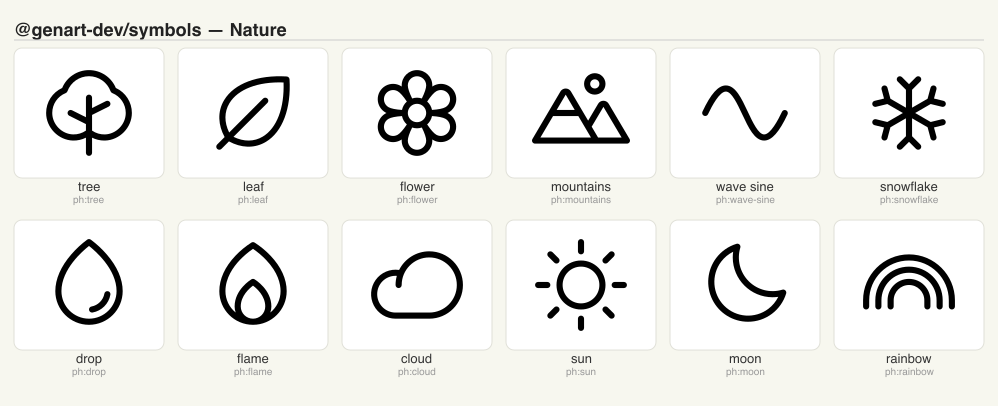
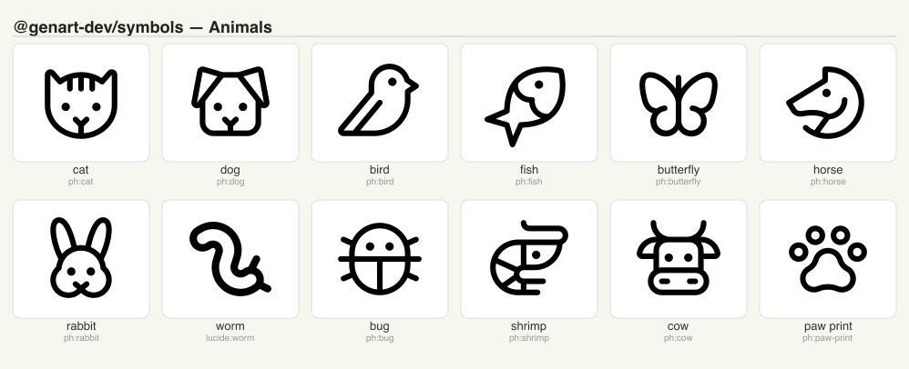
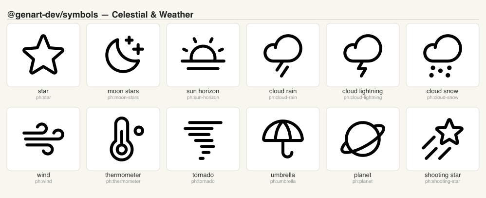
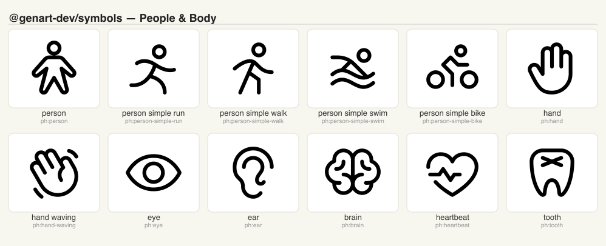
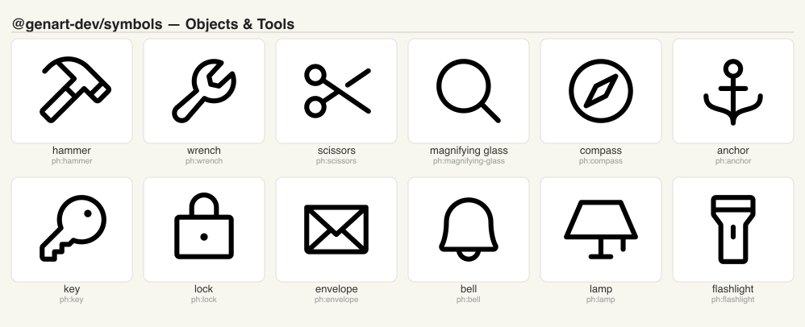
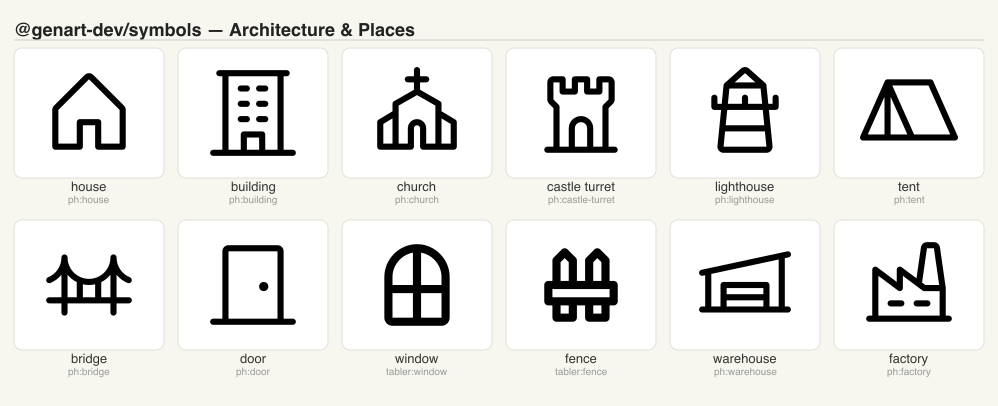
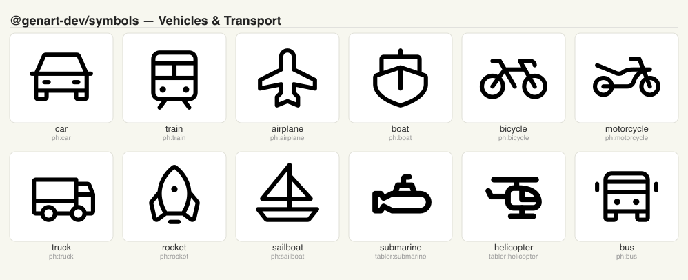
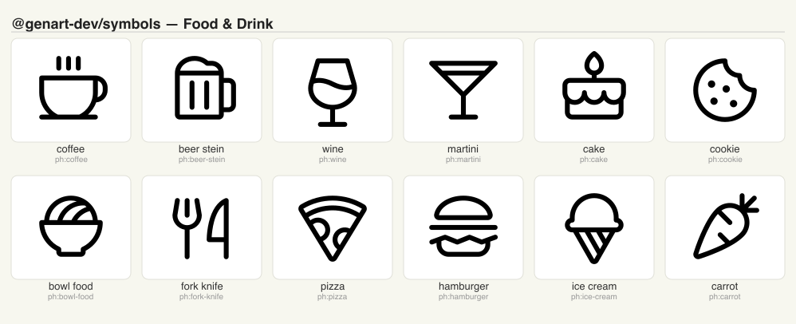
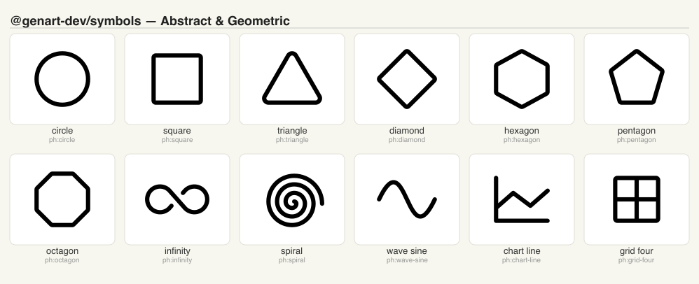

# @genart-dev/symbols

Curated vector symbol library for [genart.dev](https://genart.dev) — searchable SVG path data for generative art algorithms. Includes a built-in registry of symbols, Iconify integration for fetching thousands more, and validation utilities.

Part of [genart.dev](https://genart.dev) — a generative art platform with an MCP server, desktop app, and IDE extensions.

## Install

```bash
npm install @genart-dev/symbols
```

## Usage

```typescript
import {
  SYMBOL_REGISTRY,
  searchSymbols,
  resolveSymbol,
  listCategories,
  // Iconify integration
  searchIconify,
  fetchAndParseIcon,
  // Validation
  validateSymbol,
} from "@genart-dev/symbols";

// Search the built-in registry
const results = searchSymbols("tree");

// Resolve a symbol to SVG path data
const symbol = resolveSymbol("tree");

// Fetch from Iconify (ph, lucide, tabler, etc.)
const icon = await fetchAndParseIcon("ph:tree");
// → { id, name, iconifyId, paths: [{ d, fill?, stroke? }], viewBox }
```

## Symbol Categories

<table>
<tr>
<td><br><em>Nature</em></td>
<td><br><em>Animals</em></td>
<td><br><em>Celestial & Weather</em></td>
</tr>
<tr>
<td><br><em>People & Body</em></td>
<td><br><em>Objects & Tools</em></td>
<td><br><em>Architecture & Places</em></td>
</tr>
<tr>
<td><br><em>Vehicles & Transport</em></td>
<td><br><em>Food & Drink</em></td>
<td><br><em>Abstract & Geometric</em></td>
</tr>
</table>

## Iconify Integration

Fetch icons from any [Iconify](https://iconify.design/) prefix. Safe prefixes included by default: `ph`, `lucide`, `tabler`.

```typescript
import { searchIconify, fetchAndParseIcon, SAFE_PREFIXES } from "@genart-dev/symbols";

// Search Iconify
const results = await searchIconify("arrow", { prefix: "ph", limit: 10 });

// Fetch and parse a single icon
const icon = await fetchAndParseIcon("lucide:worm");
console.log(icon.paths); // [{ d: "M...", fill: "#222" }]
console.log(icon.viewBox); // "0 0 24 24"
```

### Iconify icon licenses

Icons fetched from Iconify are third-party works under their own licenses. Only prefixes from the `SAFE_PREFIXES` allowlist may be embedded — all use permissive licenses (MIT, ISC, or Apache-2.0) except Remix Icon which uses a custom license permitting embedding in larger works.

| Prefix | Library | License |
|--------|---------|---------|
| `ph` | [Phosphor Icons](https://github.com/phosphor-icons/core) | MIT |
| `lucide` | [Lucide](https://github.com/lucide-icons/lucide) | ISC |
| `tabler` | [Tabler Icons](https://github.com/tabler/tabler-icons) | MIT |
| `heroicons` | [Heroicons](https://github.com/tailwindlabs/heroicons) | MIT |
| `bi` | [Bootstrap Icons](https://github.com/twbs/icons) | MIT |
| `mdi` | [Material Design Icons](https://github.com/google/material-design-icons) | Apache-2.0 |
| `ri` | [Remix Icon](https://github.com/Remix-Design/RemixIcon) | Remix Icon License v1.0 |
| `carbon` | [Carbon Icons](https://github.com/carbon-design-system/carbon) | Apache-2.0 |
| `fluent` | [Fluent UI Icons](https://github.com/microsoft/fluentui-system-icons) | MIT |

When an icon is embedded in a `.genart` file, its provenance is recorded on the symbol (`iconifyId`, `license` fields) and a `ThirdPartyNotice` entry is appended to the file's `thirdParty` array. Exporters and distribution tools must surface these notices.

See [THIRD-PARTY-LICENSES.md](THIRD-PARTY-LICENSES.md) for full copyright notices, license obligations, and instructions for adding new prefixes.

## API

| Export | Description |
|--------|-------------|
| `SYMBOL_REGISTRY` | Built-in symbol registry object |
| `listCategories()` | List all available symbol categories |
| `searchSymbols(query, options?)` | Search the built-in registry |
| `resolveSymbol(id)` | Resolve a symbol by ID to path data |
| `resolveSymbolValue(value)` | Resolve a symbol value reference |
| `resolveAllSymbols(ids)` | Batch resolve multiple symbols |
| `searchIconify(query, options?)` | Search Iconify API |
| `fetchAndParseIcon(id)` | Fetch and parse an Iconify icon |
| `SAFE_PREFIXES` | Allowed Iconify prefixes |
| `validateSymbol(symbol)` | Validate a symbol definition |
| `validatePathData(d)` | Validate SVG path data string |
| `validateViewBox(viewBox)` | Validate a viewBox string |

## Related Packages

| Package | Purpose |
|---------|---------|
| [`@genart-dev/core`](https://github.com/genart-dev/core) | Plugin host, layer system |
| [`@genart-dev/format`](https://github.com/genart-dev/format) | `.genart` file format spec |
| [`@genart-dev/mcp-server`](https://github.com/genart-dev/mcp-server) | MCP server for AI agents |

## Support

Questions, bugs, or feedback — [support@genart.dev](mailto:support@genart.dev) or [open an issue](https://github.com/genart-dev/symbols/issues).

## License

MIT
